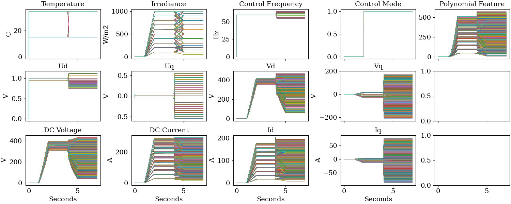
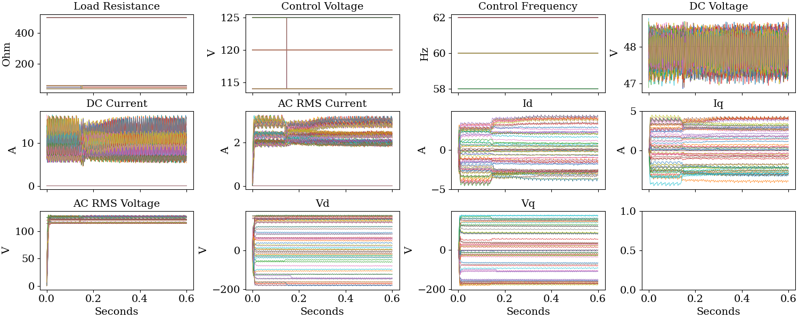
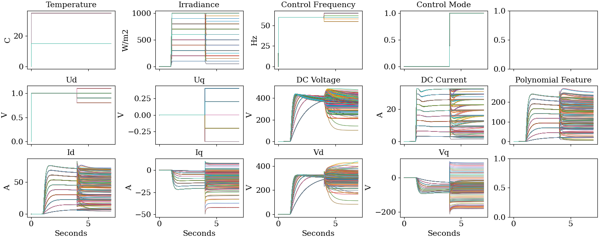
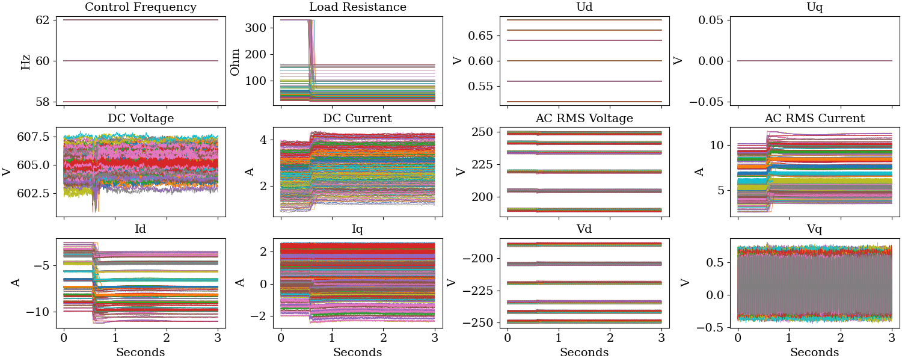
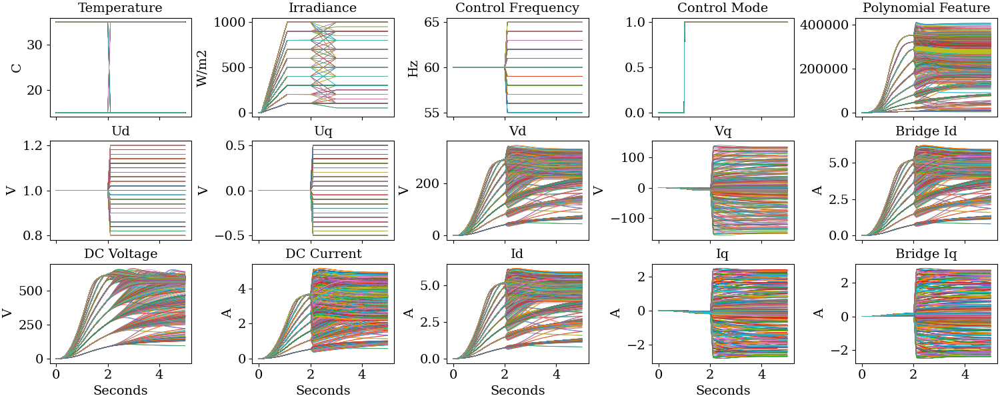
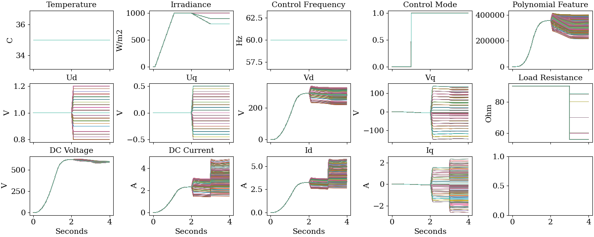
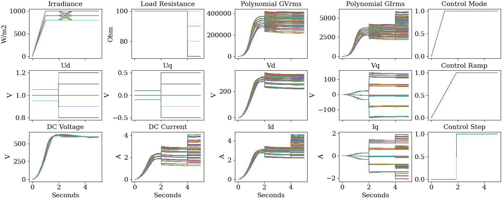
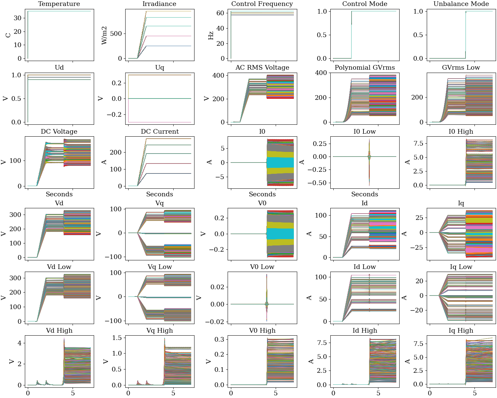

### HWPV Training Data

This directory contains data files used in the project publications and examples.

- *h5view.py* summarizes contents of an HDF5 data file
- *TrainingDataPlot.py [file]* plots contents of an HDF5 data file

Data files archived at the [Harvard Dataverse](https://doi.org/10.7910/DVN/PWW981).

| File | Records | Points | Time Step | Prefix | Source |
| ---- | ------- | ------ | --------- | ------ | ------ |
| big3 | 23400   | 3501   | 0.0020    | case   | ATP 3-phase average, balanced |
| lab2 | 69      | 5000   | 0.0012    | scope  | 1-phase lab |
| osg4 | 380     | 7001   | 0.0010    | case   | ATP 1-phase switching |
| sdi5 | 288     | 3001   | 0.0010    | scope  | SDI lab |
| ucf2 | 1500    | 2501   | 0.0020    |        | SDI Simscape |
| ucf3 | 1500    | 401    | 0.0100    | ucf    | SDI Simscape |
| ucf4 | 8100    | 501    | 0.0100    | ucf    | SDI Simscape |
| unb3 | 2430    | 3501   | 0.0020    | case   | ATP 3-phase average, unbalanced |

| File | Channels Included |
| ---- | ----------------- | 
| big3 | Ctl, Fc, G, GVrms, Id, Idc, Iq, Md, Mq, T, Vd, Vdc, Vq, t |
| lab2 | Fc, Id, Idc, Iq, Irms, Rc, Vc, Vd, Vdc, Vq, Vrms, t       |
| osg4 | Ctl, Fc, G, GVrms, Id, Idc, Iq, T, Ud, Uq, Vd, Vdc, Vq, t |
| sdi5 | Fc, Id, Idc, Iq, Irms, Rc, Ud, Uq, Vd, Vdc, Vq, Vrms, t   |
| ucf2 | Ctl, Fc, G, GVrms, Id, Idc, Iq, Isd, Isq, Md1, Mq1, T, Vdc, Vod, Voq, Vrms, t |
| ucf3 | Ctrl, Fc, G, GVrms, Id, Idc, Iq, Rload, T, Ud, Uq, Vd, Vdc, Vq, t |
| ucf4 | Ctrl, G, GIrms, GVrms, Id, Idc, Iq, Ramp, Rload, Step, Ud, Uq, Vd, Vdc, Vq, t |
| unb3 | Ctl, Fc, G, GVlo, GVrms, I0, I0hi, I0lo, Id, Idc, Idhi, Idlo, Iq, Iqhi, Iqlo, Md, Mq, T, Unb, V0, V0hi, V0lo, Vd, Vdc, Vdhi, Vdlo, Vq, Vqhi, Vqlo, Vrms, t |

**big3 Training Data Set**

**lab2 Training Data Set**

**osg4 Training Data Set**

**sdi5 Training Data Set**

**ucf2 Training Data Set**

**ucf3 Training Data Set**

**ucf4 Training Data Set**

**unb3 Training Data Set**

### License

See [License](../../license.txt)

### Notice

This material was prepared as an account of work sponsored by an agency of the United States Government.  Neither the United States Government nor the United States Department of Energy, nor Battelle, nor any of their employees, nor any jurisdiction or organization that has cooperated in the development of these materials, makes any warranty, express or implied, or assumes any legal liability or responsibility for the accuracy, completeness, or usefulness or any information, apparatus, product, software, or process disclosed, or represents that its use would not infringe privately owned rights.
Reference herein to any specific commercial product, process, or service by trade name, trademark, manufacturer, or otherwise does not necessarily constitute or imply its endorsement, recommendation, or favoring by the United States Government or any agency thereof, or Battelle Memorial Institute. The views and opinions of authors expressed herein do not necessarily state or reflect those of the United States Government or any agency thereof.

    PACIFIC NORTHWEST NATIONAL LABORATORY
                operated by
                 BATTELLE
                 for the
     UNITED STATES DEPARTMENT OF ENERGY
      under Contract DE-AC05-76RL01830

Copyright 2021-2024, Battelle Memorial Institute