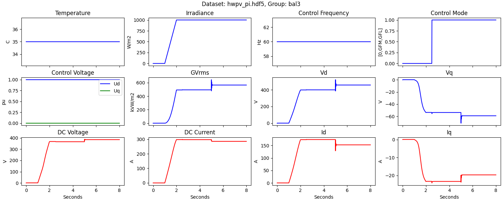

.. role:: math(raw)
   :format: html latex
..

Overview
========

Power Electronic Converter Blocks (pecblocks) use the output of detailed 
electromagnetic transient (EMT) simulations to produce generalized block 
diagram models of power electronic systems. The process uses deep learning 
with customized block architectures. The outputs are reduced-order models 
that meet specified accuracy requirements, while providing important 
advantages over the original EMT models: 

* Converter Block models have fewer nodes and can take longer time steps, resulting in shorter simulation times
* Converter Block models are continuously differentiable, making them compatible with control design methods

Models will run in both time domain and frequency domain. The scope 
includes not only the power electronic converter, but also the 
photovoltaic (PV) array, maximum power point tracking (MPPT), phase-lock 
loop (PLL) control, output filter circuits, battery storage if present, 
etc. The applications include but may not be limited to solar power 
inverters, energy storage converters, motor drives, and other power 
electronics equipment. 

Background
----------

For technical background on *pecblocks*, see `SysDO 2024 Paper (submitted) <_static/paper.pdf>`_

For technical background on *dynoNet*, see `Forgione, Piga Paper <https://arxiv.org/pdf/2006.02250>`_

For technical background on grid-forming inverters, see `Rathnayake, et. al. <https://doi.org/10.1109/ACCESS.2021.3104617>`_

Installation
------------

To install the Python package::

    pip install pecblocks

Quick Start
-----------

The package includes two examples. Find location of examples::

    pip show pecblocks

Sample return::

    Location: c:\users\tom\appdata\local\programs\python\python310\lib\site-packages

Training a Model
^^^^^^^^^^^^^^^^

From the *examples/training* directory::

    download
    train ucf3

The first command will download a 90-MB sample data file. The second 
command trains a model, which will take several minutes. Introductory 
information appears, then a progress log:: 

    Epoch 1420 of 2000 | TrLoss     0.002372 | VldLoss     0.002475 | SensLoss     0.000000 | RMSE       0.0097 | Sigma       0.0000

The training loss (*TrLoss*) and validation loss (*VldLoss*) should 
decrease over time, and approach the same order of magnitude. The *RMSE* 
represents a root mean square error over all output channels. The goal is 
for *RMSE < 0.05* Even when the logged values are below *0.05*, some 
output channels may exceed *0.05*, so the log is just a general indicator 
of the fitting error. *SensLoss* and *Sigma* are zero in this example 
because no attempt is made to optimize the *dq-axis* sensitivities between 
AC voltages and currents. 

When training completes, the *examples/training/ucf3/summary.txt* file should look like this::

    Dataset Summary: (Mean=Offset, Range=Scale)
    Column       Min       Max      Mean     Range
    G         -0.000   999.995   811.581   999.995
    Ud         0.800     1.200     1.011     0.400
    Uq        -0.499     0.501    -0.006     1.000
    Vd         0.000   337.082   219.318   337.082
    Vq      -150.297   139.415    -6.328   289.712
    GVrms     -0.000 414899.656 253630.828 414899.656
    Ctrl       0.000     1.000     0.748     1.000
    Vdc        0.000   628.176   461.755   628.176
    Idc        0.000     4.834     1.992     4.834
    Id         0.000     5.783     2.681     5.783
    Iq        -2.635     2.342    -0.080     4.977
    COL_Y ['Vdc', 'Idc', 'Id', 'Iq']
    Train time: 1539.16, Recent loss: 0.002186, RMS Errors: 0.0030 0.0116 0.0111 0.0047

All four output channels have *RMSE < 0.05*.

The loss plot in *examples/training/ucf3/ucf3_train_loss.pdf* should look like this:

Then export the trained model for s-domain simulations::

    export ucf3

Some important results of this export appear in *examples/training/ucf3/metrics.txt*. In the top section::

    Read Model from: ./ucf3/
    Export Model to: ./ucf3/ucf3_fhf.json
    idx_in [0, 1, 2, 3, 4, 5, 6]
    idx_out [7, 8, 9, 10]
    make_mimo_block iir
    H1s[0][0]  Real Poles: [-114.2569614   -56.88678796] Freqs [Hz]: []
    H1s[0][1]  Real Poles: [-132.60159228  -58.71635642] Freqs [Hz]: []
    H1s[0][2]  Real Poles: [-98.54142517 -98.54142517] Freqs [Hz]: [9.63376790827413]
    H1s[0][3]  Real Poles: [-95.95237076 -95.95237076] Freqs [Hz]: [4.705452200660855]
    H1s[1][0]  Real Poles: [-135.80799026  -81.8345316 ] Freqs [Hz]: []
    H1s[1][1]  Real Poles: [-99.05355517 -99.05355517] Freqs [Hz]: [4.234559773533419]
    H1s[1][2]  Real Poles: [-93.8685894 -93.8685894] Freqs [Hz]: [2.7041085997372196]
    H1s[1][3]  Real Poles: [-98.32965601 -98.32965601] Freqs [Hz]: [8.50833798367145]
    H1s[2][0]  Real Poles: [-118.25321707  -74.03952537] Freqs [Hz]: []
    H1s[2][1]  Real Poles: [-143.31944483  -26.50642794] Freqs [Hz]: []
    H1s[2][2]  Real Poles: [-92.25928336 -92.25928336] Freqs [Hz]: [7.307075566267579]
    H1s[2][3]  Real Poles: [-126.34298102  -28.01220818] Freqs [Hz]: []
    H1s[3][0]  Real Poles: [-127.22251461  -62.11887925] Freqs [Hz]: []
    H1s[3][1]  Real Poles: [-102.89434604 -102.89434604] Freqs [Hz]: [3.9716432768384853]
    H1s[3][2]  Real Poles: [-104.9091462 -104.9091462] Freqs [Hz]: [4.3754426482151345]
    H1s[3][3]  Real Poles: [-126.92004256  -64.34811764] Freqs [Hz]: []

All of the *H1(s)* poles have negative real parts, so they are stable. 
Some of these poles are complex conjugate pairs, others are real and 
distinct pairs. Before using *H1(s)* in simulation, check that all of its 
poles are stable. 

In the bottom section of *examples/training/ucf3/metrics.txt*::

    1498,0.0031,0.0103,0.0086,0.0139
    1499,0.0031,0.0099,0.0087,0.0126
    Highest RMSE Cases
    Vdc  Max RMSE=  0.0057 at Case 1435; 0 > 0.05
    Idc  Max RMSE=  0.0337 at Case 34; 0 > 0.05
    Id   Max RMSE=  0.0344 at Case 533; 0 > 0.05
    Iq   Max RMSE=  0.0202 at Case 515; 0 > 0.05
    Total Error Summary
    Vdc  RMSE=  0.0030
    Idc  RMSE=  0.0116
    Id   RMSE=  0.0111
    Iq   RMSE=  0.0047

We can see that none of the 1500 cases have *RMSE > 0.05*. Case 533 has 
the highest *RMSE* value for the output *Id*. For a Norton model, *Id* is 
probably the most important output channel. In the middle of the 
*metrics.txt* file, we can find some individual case results for the 
*RMSE* of each output channel:: 

    533,0.0030,0.0318,0.0344,0.0106

We can plot the fitting result for this worst case as follows::

    python pv3_test.py ucf3_config.json 533

The result looks like:

*RMSE* values in the plot caption match those in *metrics.txt*, but the
initial values are not exactly zero. The initialization can be improved
for simulation, but the *RMSE* values then may not exactly match the
values in *metrics.txt*. For more information, check the *usage* documentation from::

    python pv3_test.py

Simulating a Model
^^^^^^^^^^^^^^^^^^

From the *example/sdomain* directory::

    go.bat or ./go.sh

This runs a continous-time simulation of a trained HWPV model, at a longer time
step than the original z-domain model was trained at. The result looks like:

Example Repository
------------------

See `GitHub Examples directory <https://github.com/pnnl/pecblocks/tree/master/examples>`_

