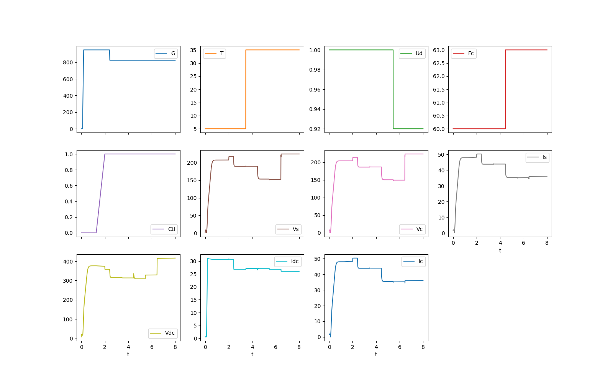

### HELICS Example

HELICS 3.4 and the Python wrapper must be installed:

    pip install helics
    pip install helics-apps

To run the case: 

    python pv1_configure_helics.py
    pv1_helics

To plot the results shown below:

    python pv1_plot.py

The relevant files are:

- _\*.log_ contains text and debugging output from the HELICS federates
- _clean.bat_ deletes the log and json files mentioned in this list
- _flat3.txt_ alternative input stimuli for _helics_player.txt_
- _helics_player.txt_ read by the _helics_player_, contains weather and control inputs for the simulation
- _kill23404.bat_ helper script to halt a HELICS federation that didn't exit cleanly. Assumes each federate and the broker use port 23404, which is the default. Call this once for each federate that's still running. If a federate refuses to exit (on Windows) just wait about 30 seconds.
- _list23404.bat_ helper script to list all HELICS federates that are listening to port 23404.
- _pv1_client.json_ contains HELICS publication, subscription, and other configurations for _pv1_client.py_
- _pv1_client.py_ a HELICS federate that constructs _Vrms_ from _Irms_ and _Rgrid_, and collects the simulation data from _pv1_server.py_. It takes the role of an EMT simulator using the HW-PV model.
- _pv1_configure_helics.py_ produces _pv1_client.json_, _pv1_server.json_, and _pv1_helics.bat_. Reads _pv1_fhf_poly.json_ for model information.
- _pv1_helics.bat_ launches the HELICS broker and three federates (player, client, and server)
- _pv1_plot.py_ makes a quick plot from _pv1_server.hdf5_
- _pv1_server.hdf5_ output data from _pv1_server.py_ in a Pandas DataFrame
- _pv1_server.json_ contains HELICS publication, subscription, and other configurations for _pv1_server.py_
- _pv1_server.py_ is a HELICS federate that subscribes to all weather and control inputs, runs the HW-PV model, and publishes the HW-PV model outputs. In this example, the input and output data are saved from this federate for convenience.
- _ramp3.txt_ alternative input stimuli for _helics_player.txt_
- _ucf.txt_ alternative input stimuli for _helics_player.txt_

**HELICS Federates and Message Topics**

**System Simulation using HELICS**

### License

See [License](../../license.txt)

### Notice

This material was prepared as an account of work sponsored by an agency of the United States Government.  Neither the United States Government nor the United States Department of Energy, nor Battelle, nor any of their employees, nor any jurisdiction or organization that has cooperated in the development of these materials, makes any warranty, express or implied, or assumes any legal liability or responsibility for the accuracy, completeness, or usefulness or any information, apparatus, product, software, or process disclosed, or represents that its use would not infringe privately owned rights.
Reference herein to any specific commercial product, process, or service by trade name, trademark, manufacturer, or otherwise does not necessarily constitute or imply its endorsement, recommendation, or favoring by the United States Government or any agency thereof, or Battelle Memorial Institute. The views and opinions of authors expressed herein do not necessarily state or reflect those of the United States Government or any agency thereof.

    PACIFIC NORTHWEST NATIONAL LABORATORY
                operated by
                 BATTELLE
                 for the
     UNITED STATES DEPARTMENT OF ENERGY
      under Contract DE-AC05-76RL01830

Copyright 2021-2024, Battelle Memorial Institute
