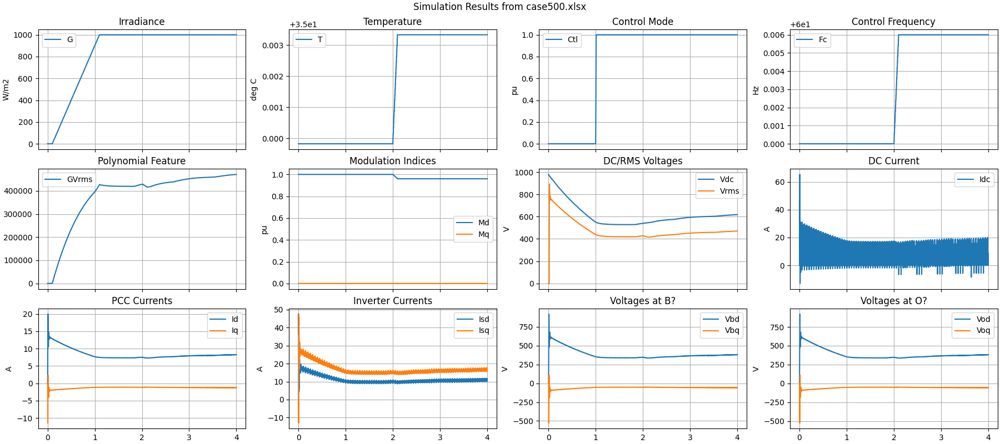
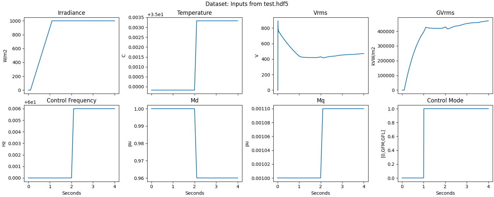
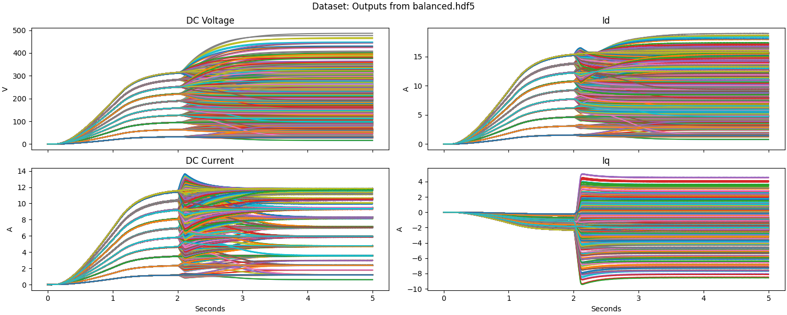
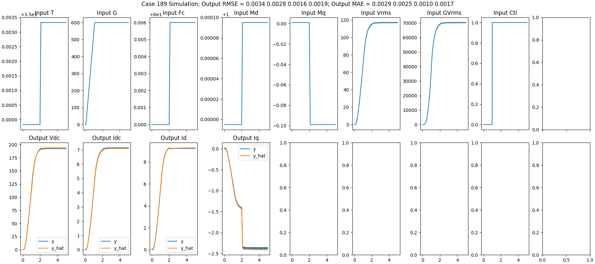

## HWPV Training Data from Simscape Electrical

Scripts and test files for converting Simscale Electrical simulation
outputs, in the form of Excel workbooks, to HWPV training data, in
the form of COMTRADE-compatible channels saved to HDF5.

### File Directory

The scripts and test files currently used in this example are:

- _case500.xlsx_ from Simscape Electrical. It should be named like _case####.xlsx_, where _####_ is a case number from 0..n
- _xlsx\_to\_hdf5.py_ reads and plots the XLSX file, then creates _test.hdf5_. The plot was manually saved to _case500.png_.
- _h5view.py_ summarizes the groups (cases) and channels in _test.hdf5_
- _training\_plot.py_ reads and plots from _test.hdf5_, which verifies that the HDF5 data is in the format designed for HWPV model training scripts. It produces _BalInputs.png_ and _BalOutputs.png_.

### Example Results

To run this example:

    python xlsx_to_hdf5.py
    python h5view.py
    python training_plot.py

In the first example simulation result, shown below, some corrections were identified:

- The output variables do not start at zero output. When _G_ is zero at _t=0_, _Vdc_ seems to be at its open-circuit value at _t=0_. This leads to non-zero initialization of _Idc_, _Id_, and _Iq_. This will cause problems in fitting HWPV models.
- Oscillations in _Idc_ will also cause problems in fitting HWPV models. Is there a filtered _Idc_ available from Simscape?
- Scaling of _GVrms_; this channel should have a multiplier of 0.001. This can be done in the _xlsx_ file, or added to _xlsx\_to\_hdf5.py_.
- Define the locations of _Vod_, _Voq_, _Vbd_, and _Vbq_ on a circuit diagram.
- The time step was not defined in _case500.xlsx_. The assumption is 0.002s, because it results in a 4-second simulation time.
- The training simulations should now begin with 1 second of zero initialization, i.e., the ramp in _G_ should start at 1s. The step event should begin at 3s, and the simulation runs for 5s.

### Fitted Model

A full set of 1500 Simscape training simulations was provided, with most of the noted corrections.
As shown below, the ramp in _G_ still begins at 0.1s instead of 1.0s.

An HWPV model was fitted to this data, achieving normalized RMSE=[0.0093 0.0079 0.0068 0.0036] for [Vdc Idc Id Iq]
after 2000 iterations. All s-domain poles of H1(s) are stable. The training time was 6.63 hours. An example
result of the fitted model is shown below. See _balanced\_fhf.json_ for the HWPV coefficients and _log.txt_ for
a record of the training loss and H1(s) poles.

### License

See [License](../../license.txt)

### Notice

This material was prepared as an account of work sponsored by an agency of the United States Government.  Neither the United States Government nor the United States Department of Energy, nor Battelle, nor any of their employees, nor any jurisdiction or organization that has cooperated in the development of these materials, makes any warranty, express or implied, or assumes any legal liability or responsibility for the accuracy, completeness, or usefulness or any information, apparatus, product, software, or process disclosed, or represents that its use would not infringe privately owned rights.
Reference herein to any specific commercial product, process, or service by trade name, trademark, manufacturer, or otherwise does not necessarily constitute or imply its endorsement, recommendation, or favoring by the United States Government or any agency thereof, or Battelle Memorial Institute. The views and opinions of authors expressed herein do not necessarily state or reflect those of the United States Government or any agency thereof.

    PACIFIC NORTHWEST NATIONAL LABORATORY
                operated by
                 BATTELLE
                 for the
     UNITED STATES DEPARTMENT OF ENERGY
      under Contract DE-AC05-76RL01830

Copyright 2021-2024, Battelle Memorial Institute